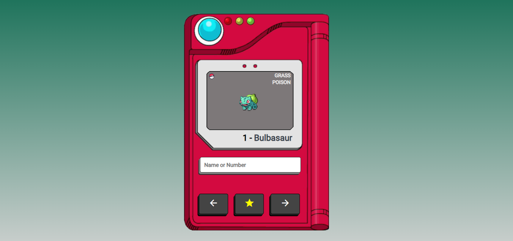

# Pokédex
[BR] Projeto de uma Pokédex responsiva, criada com a utilização de HTML, CSS e Javascript. A pesquisa dos Pokémons pode ser feita pelo nome, id ou utilizando os botões de setas. 
A Pokédex apresenta as seguintes informações dos Pokémons: imagem, id, nome, tipo ou tipos e imagem da versão shiny caso o botão de estrela seja apertado.    
[EN] Project of a responsive Pokédex, created using HTML, CSS and Javascript. You can search for the Pokémons by name, ID or using the arrow buttons.
The Pokédex displays the following Pokémons informations: image, ID, name, type or types and image of the shiny version if the star button is pressed.

## Imagem do Projeto:
 

